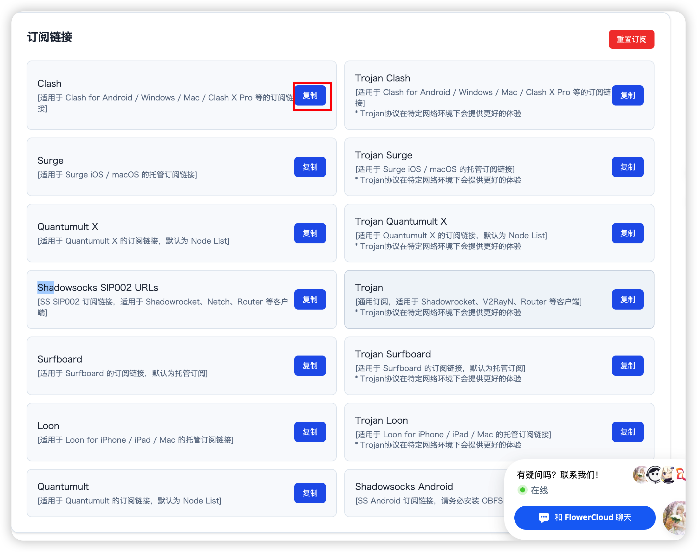
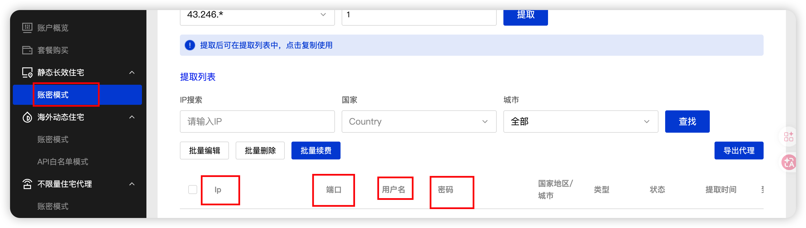
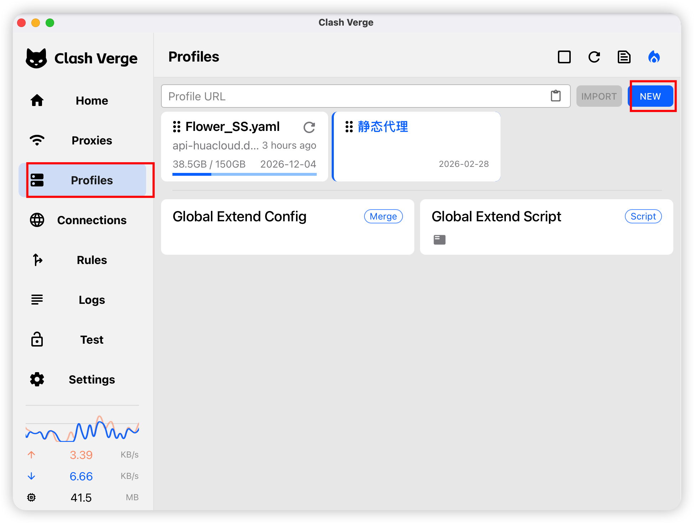
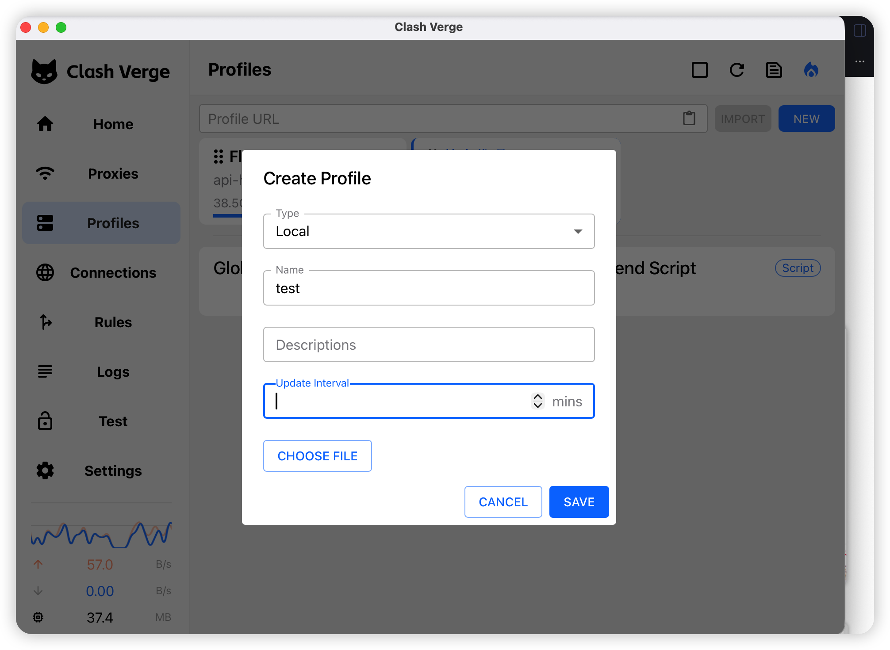
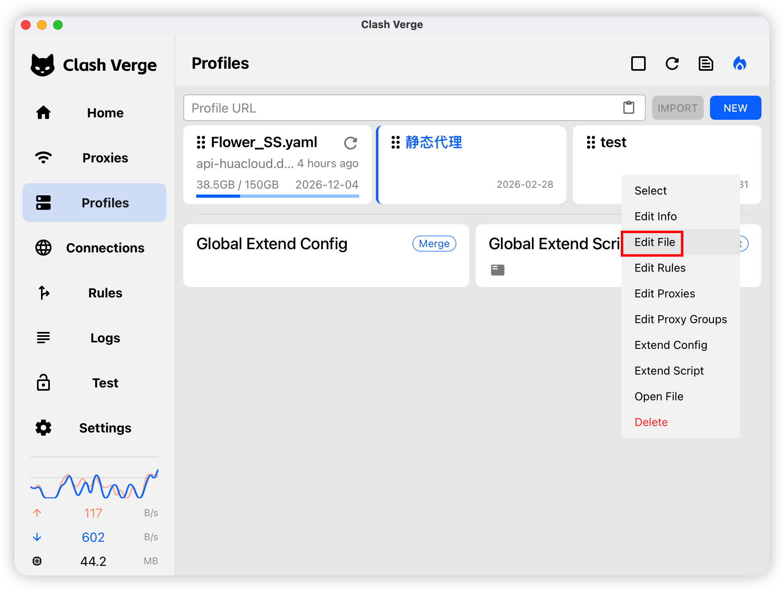
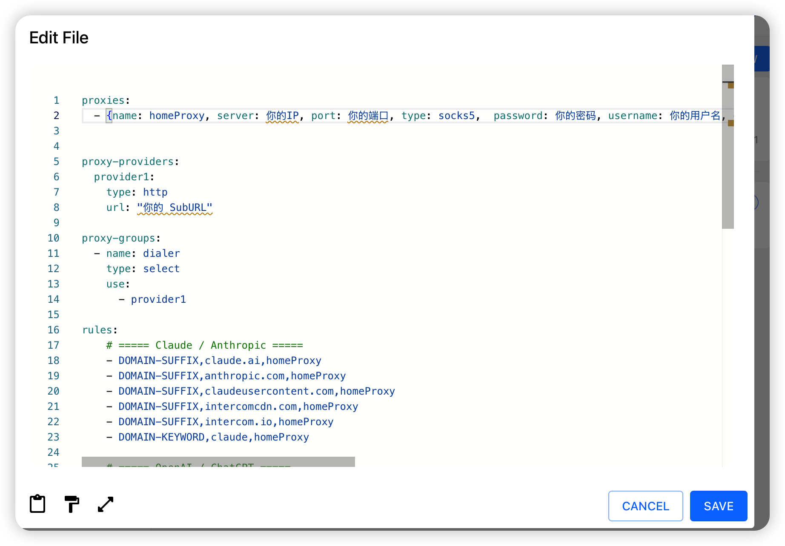
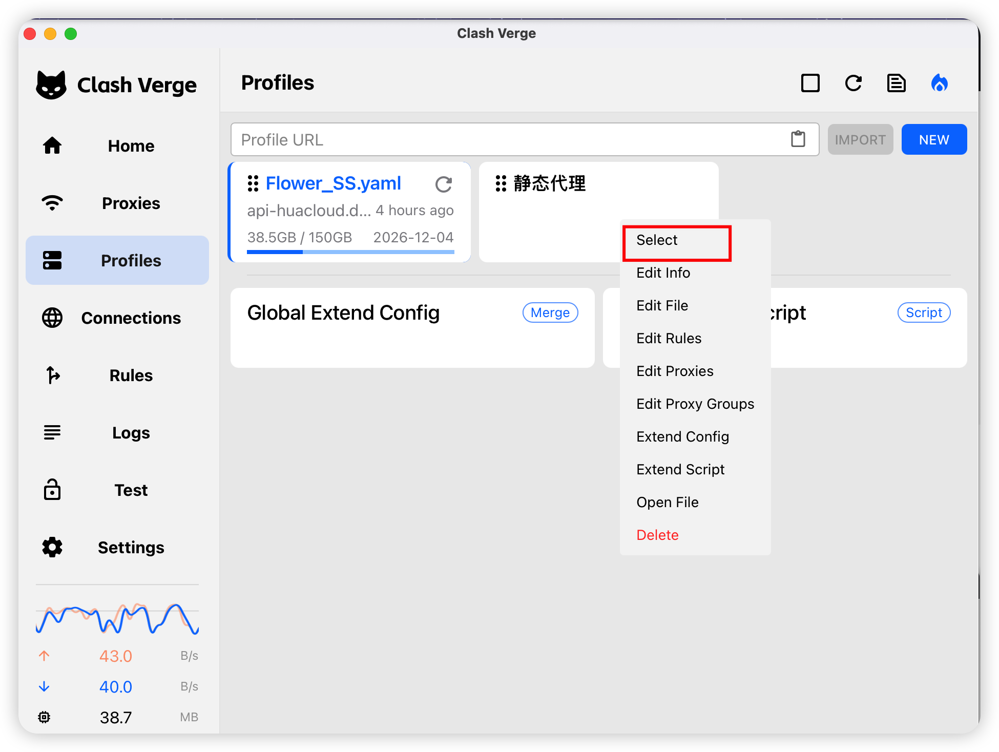
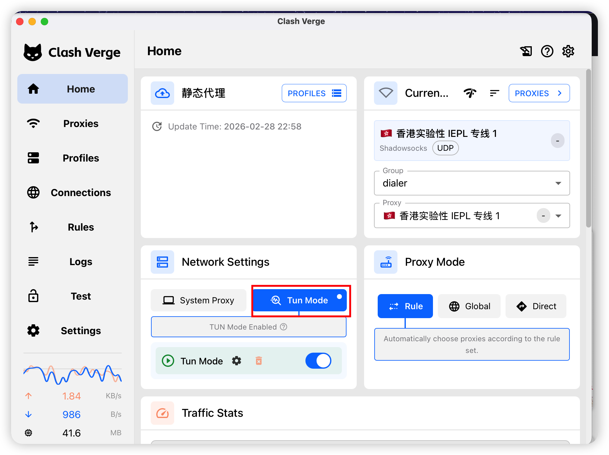
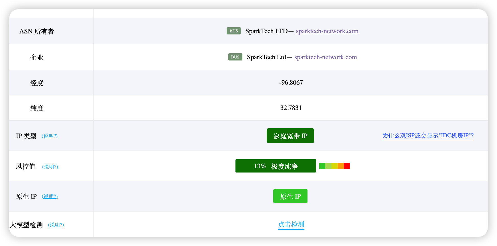

# Clash Verge 中 dialer-proxy 的一个配置示例

## 整体原理

本机 -> 机场 -> 静态住宅 -> 目标网站，通过 Clash Verge 实现。
[参考文档](https://wiki.metacubex.one/config/proxies/dialer-proxy/)

## 前置准备

1. 一个机场账号与套餐
2. 一个静态住宅 IP
3. 一个 Clash Verge 软件
    [下载地址](https://www.clashverge.dev/install.html#__tabbed_1_3)

## 具体配置

1. 找到机场代理订阅地址，选择 Clash 订阅,获得订阅 URL，后面用 SubURL 替代。
 


2. 找到购买的静态住宅代理 IP,端口,账号,密码
   


3. 首先新建一个 Profile,选择本地类型


4. 使用如下配置，将其中变量修改为上面获得的各种 URL 和变量。



```yaml
proxies:
  - {name: homeProxy, server: 你的IP, port: 你的端口, type: socks5,  password: 你的密码, username: 你的用户名, dialer-proxy: dialer}


proxy-providers:
  provider1:
    type: http
    url: "你的订阅地址"

proxy-groups:
  - name: dialer
    type: select
    use:
      - provider1

rules:
    # ===== Claude / Anthropic =====
    - DOMAIN-SUFFIX,claude.ai,homeProxy
    - DOMAIN-SUFFIX,anthropic.com,homeProxy
    - DOMAIN-SUFFIX,claudeusercontent.com,homeProxy
    - DOMAIN-SUFFIX,intercomcdn.com,homeProxy
    - DOMAIN-SUFFIX,intercom.io,homeProxy
    - DOMAIN-KEYWORD,claude,homeProxy

    # ===== OpenAI / ChatGPT =====
    - DOMAIN-SUFFIX,openai.com,homeProxy
    - DOMAIN-SUFFIX,chatgpt.com,homeProxy
    - DOMAIN,api.openai.com,homeProxy
    - DOMAIN,api.chatgpt.com,homeProxy
    - DOMAIN-SUFFIX,oaistatic.com,homeProxy
    - DOMAIN-SUFFIX,oaiusercontent.com,homeProxy
    # 可选：部分登录/风控链路可能会用到
    - DOMAIN-SUFFIX,auth0.com,homeProxy

    - GEOIP,CN,DIRECT
    # 默认所有都走代理
    - MATCH,homeProxy
```
Tips: 这个地方为了兜底，所有未命中规则的请求都会走代理链兜一圈，可以自己加规则，或者将默认兜底改到 dailer。

5. 选择对应 Profile,然后开启虚拟网卡模式即可。



6. 通过 ping0.cc 或者其他类似网站验证 IP


# 免责说明

* 本文仅用于介绍代理链路与规则分流的技术配置方式，不构成对任何第三方代理服务、网络服务或平台可用性的承诺。
* 请在遵守当地法律法规、所在组织安全制度以及目标平台服务条款的前提下使用相关配置。
* 请勿将本文内容用于违法违规、侵权、欺诈、批量注册、绕过风控或其他不当用途。
* 使用第三方代理服务可能带来账号风险、隐私风险、费用风险与稳定性风险，相关后果需由使用者自行承担。
* 发布或分享配置、截图与日志前，请确认已妥善隐藏订阅链接、账号密码、Token、IP 地址及其他敏感信息。

## 自用推广链接，不做推荐

机场:https://api-flowercloud.com/aff.php?aff=18251
辣椒代理: https://share.lajiaohttp.com/share/hpvsd4luu